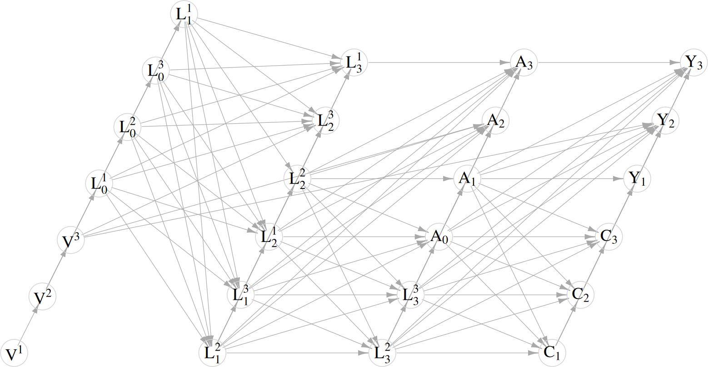
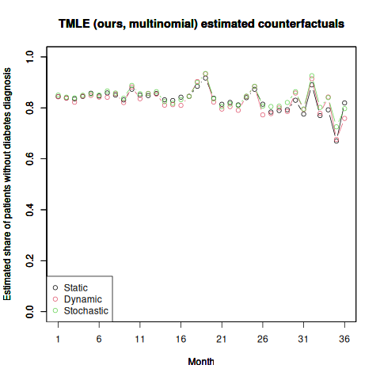

# multi-ltmle

Simulation code for Longitudinal TMLE (LTMLE) with multi-valued treatments. 

Please cite the following paper if you use this repo:

```
@article{doi:10.1002/sim.10003,
  title={Targeted learning in observational studies with multi-valued treatments: An evaluation of antipsychotic drug treatment safety.},
  author={Poulos, Jason and Horvitz-Lennon, Marcela and Zelevinsky, Katya and Cristea-Platon, Tudor and Huijskens, Thomas and Tyagi, Pooja and Yan, Jiaju and Diaz, Jordi and Normand, Sharon-Lise},
  journal={Statistics in Medicine},
  year={2024},
   publisher={Wiley Online Library}
}
```

Prerequsites
------

* **R** (tested on 4.0.1 using a 6.2.0 GCC compiler)
+ Required **R** packages located in ***package_list.R***
+ The result of sessionInfo() is in ***session_info.txt***

* For use of 'tmle-lstm' as an estimator: **R** (4.3.3), **python3** (3.10.12), and **TensorFlow** (2.18.0)

+ Instructions for installing Tensorflow on Linux (documentation [here](https://packaging.python.org/en/latest/guides/installing-using-pip-and-virtual-environments/) and [here](https://www.tensorflow.org/install/pip#linux))
```bash
# Create virtual environment within directory
cd multi-ltmle

# Manually set up a virtual environment
python3.10 -m ensurepip --upgrade  # Ensure pip is installed/upgraded
python3.10 -m pip install virtualenv  # Install virtualenv if not already available
virtualenv myenv  # Create a virtual environment named 'myenv'
source myenv/bin/activate  # Activate the new environment

# Install TensorFlow
python3 -m pip install --upgrade pip  # Upgrade pip to the latest version
# For GPU users:
pip install tensorflow[and-cuda]
# For CPU users:
pip install tensorflow

# Verify the GPU installation:
python3 -c "import tensorflow as tf; print(tf.config.list_physical_devices('GPU'))"

# Verify the CPU installation:
python3 -c "import tensorflow as tf; print(tf.reduce_sum(tf.random.normal([1000, 1000])))"
```
+ The following Python packages are required: numpy (tested on 1.19.5), pandas (1.1.5), and wandb (0.15.12)
```bash
python3 -m pip install pandas
python3 -m pip install wandb
```
+ Additional **R** package in ***package_list.R***  are required. Make sure to install these packages in the virtual environment where python3 and Tensorflow are installed.

+ Ensure that the path in *use_python()* in **simulation.R** corresponds to the virtual environment python path, which you can find using
```bash
which python
```

+ **Test with R and Reticulate**  
   Load the `reticulate` library and bind to the shared Python:
   ```r
   library(reticulate)
   use_python("./myenv/bin/python", required = TRUE)
   py_config()
   ```

+ **Important Notes**  
   - If the shared library is still not found, adjust the `LD_LIBRARY_PATH` as required:
     ```bash
     export LD_LIBRARY_PATH=/path/to/libpython3.10.so:$LD_LIBRARY_PATH
     ```
   - For consistent performance, ensure all dependencies align with the Python version used in your virtual environment.

Contents
------

### **package_list.R**
- Installs required **R** packages.
  - **doMPI**: Logical flag. When `TRUE`, installs packages required for MPI parallel processing (defaults to `FALSE`).
  - **keras**: Logical flag. When `TRUE`, installs packages required for Keras/TensorFlow (defaults to `TRUE`).

### **src/misc_fns.R**
- Includes miscellaneous functions:
  - Bounding predicted probabilities.
  - Generating various distributions.
  - A function for forest plot visualization.

### **src/simcausal_fns.R**
- Defines distribution functions for the *simcausal* software.

### **src/simcausal_dgp.R**
- Defines the data-generating process for the *simcausal* software.

### **src/plotDAG_improved.R**
- Improved DAG plotting function from the *simcausal* software.

### **src/tmle_fns.R**
- Defines treatment rule functions used for Targeted Maximum Likelihood Estimation (TMLE).

### **src/tmle_IC.R**
- Implements influence curve (IC)-based methods for variance estimation in TMLE.

### **src/SL3_fns.R**
- Provides custom learner definitions for use with the SuperLearner framework.

### **src/tmle_fns_lstm.R**
- TMLE implementation for incorporating Long Short-Term Memory (LSTM) neural networks into the TMLE workflow.

### **src/lstm.R**
- Facilitates integration between R and Python for LSTM-based estimations. Used when `estimator='tmle-lstm'`.

### **src/train_lstm.py**
- Python script for training LSTMs and predicting on the full dataset.

### **src/test_lstm.py**
- Python script for predicting on new data (for the targeting step).

### **simulation.R**
- Simulates longitudinal data for comparing the performance of multinomial TMLE with LSTM-based approaches.
  - **Key parameters**:
    - **estimator**: Choose between `'tmle'` or `'tmle-lstm'`.
    - **treatment.rule**: Specify "static", "dynamic", "stochastic", or "all".
    - **gbound**/**ybound**: Bounds for propensity scores and initial predictions, respectively.
    - **J**: Number of treatments (`J=6`).
    - **n**: Sample size (default is `12500`).
    - **t.end**: Number of time periods (must be between `4` and `36`).
    - **R**: Number of simulation runs (default is `325`).
    - **target.gwt**: Logical flag to adjust weights in the clever covariate (default is `TRUE`).
    - **use.SL**: Logical flag to enable Super Learner (default is `TRUE`).
    - **scale.continuous**: Logical flag for scaling continuous variables.
    - **n.folds**: Number of cross-validation folds for Super Learner (default is `5`).

### **long_sim_plots.R**
- Aggregates and visualizes the output of `simulation.R`. Includes:
  - Counterfactual risk estimations.
  - Bias, coverage, and confidence interval widths.


Required File Modifications
------

Below is a list of files that require user modifications to match their environment or particular settings. Please ensure to make these changes before running the code.

### `simulation.R`
- Update the Python path used by `use_python()`. Modify it to point to the Python interpreter you wish to use. For example:
  ```r
  use_python("./myenv/bin/python", required=TRUE)
  ```

### `train_lstm.py`
- **If using a GPU**, configure the GPU settings by updating relevant CUDA paths to match your environment. The default settings are:
  ```python
  cuda_base = "/n/app/cuda/12.1-gcc-9.2.0"
  os.environ.update({
      'CUDA_HOME': cuda_base,
      'CUDA_ROOT': cuda_base,
      'CUDA_PATH': cuda_base,
      'CUDNN_PATH': f"{cuda_base}/lib64/libcudnn.so",
      'LD_LIBRARY_PATH': f"{cuda_base}/lib64:{cuda_base}/extras/CUPTI/lib64:{os.environ.get('LD_LIBRARY_PATH', '')}",
      'PATH': f"{cuda_base}/bin:{os.environ.get('PATH', '')}",
      'CUDA_DEVICE_ORDER': 'PCI_BUS_ID',
      'CUDA_VISIBLE_DEVICES': '0,1',
      'TF_FORCE_GPU_ALLOW_GROWTH': 'true',
      'TF_XLA_FLAGS': '--tf_xla_enable_xla_devices',
      'XLA_FLAGS': f'--xla_gpu_cuda_data_dir={cuda_base}',
      'TF_GPU_THREAD_MODE': 'gpu_private',
      'TF_GPU_THREAD_COUNT': '2',
      'TF_CPP_MIN_LOG_LEVEL': '3'
  })
  ```

- If no GPU is used, the script will automatically fall back to CPU-based execution. No additional changes are required in this case.

### `utils.py`
- Include your wandb username in the "entity" field in the setup_wandb() function: 
  ```python
    run = wandb.init(
        project="multi-ltmle",
        entity="username",
        config=config,
        name=f"lstm_{datetime.now().strftime('%Y%m%d_%H%M%S')}",
        mode="offline",  # Run offline to prevent uploads
    )
  ```

Instructions
------

### 1. Install Required R Packages and Set Up Environment
- Run the following command to install the required **R** packages:
  ```bash
  Rscript package_list.R
  ```
- Follow the Python installation instructions provided in the **Prerequisites** section. 
- Ensure you start **R** within the virtual environment where Python 3 and TensorFlow are installed.

---

### 2. Run Simulations
To execute simulations, use the following command:

```bash
Rscript simulation.R [arg1] [arg2] [arg3] [arg4]
```

#### Arguments:
- **`[arg1]`**: Specifies the estimator. Options:
  - `"tmle"`: Targeted Maximum Likelihood Estimation ('tmle').
  - `"tmle-lstm"`: Targeted Maximum Likelihood Estimation with Long Short-Term Memory ('tmle-lstm').
- **`[arg2]`**: Number of cores to use (>1 for parallel computation)
- **`[arg3]`**: Logical flag to indicate whether super learner estimation should be used:
  - `"TRUE"` or `"FALSE"`.
- **`[arg4]`**: Logical flag for enabling MPI parallel programming:
  - `"TRUE"` or `"FALSE"`.

#### Examples:
1. Using the `"tmle"` estimator with super learner enabled and no MPI, using 4 cores for parallel computation:
   ```bash
   Rscript simulation.R 'tmle' 4 'TRUE' 'FALSE'
   ```

2. Using the `"tmle-lstm"` estimator, using 2 cores for parallel computation:
   ```bash
   Rscript simulation.R 'tmle-lstm' 2 'FALSE' 'FALSE'
   ```

---

### 3. Plot Simulation Results
To create tables and plot results from simulations:
```bash
Rscript long_sim_plots.R 'outputs/20250328' 'outputs/20250404'
```
Latex tables are saved to `tables/` and plots to `sim_results/`.

---

Model Weights, Intermediate Results, and Visualizations
------

This section outlines the model weights, intermediate results, and visualizations available for analysis and evaluation. The results pertain to a single simulated longitudinal dataset (r=1) for 12,500 patients, estimating counterfactual diabetes risk under three regimes: static, dynamic, and stochastic. **Data and results are saved in the `ex_outputs/` directory unless otherwise noted.**

#### Key Files and Descriptions:

1. **Simulated Dataset**
   - Long format dataset: `tmle_dat_long_R_1_n_10000_J_6.rds`

2. **Intermediate Simulation Results**
   - LTMLE-SL: `intermediate_results_sl.rds`
   - LTMLE-RNN: `intermediate_results_lstm.rds` 

3. **Validation Predictions**
   - Binary `C` predictions: `lstm_bin_C_preds.npy`, `lstm_bin_C_preds_info.npz`
   - Categorical `A` predictions: `lstm_cat_A_preds.npy`, `lstm_cat_A_preds_info.npz`
   - Binary `A` predictions: `lstm_bin_A_preds.npy`, `lstm_bin_A_preds_info.npz`
   - Binary `Y` predictions: `lstm_bin_Y_preds.npy`, `lstm_bin_Y_preds_info.npz`

4. **Test Predictions**
   - Binary `C` predictions: `test_bin_C_preds.npy`, `test_bin_C_preds_info.npz`
   - Categorical `A` predictions: `test_cat_A_preds.npy`, `test_cat_A_preds_info.npz`
   - Binary `A` predictions: `test_bin_A_preds.npy`, `test_bin_A_preds_info.npz`
   - Binary `Y` predictions: `test_bin_Y_preds.npy`, `test_bin_Y_preds_info.npz`

5. **Model Weights**
   - Model info. and weights for RNN models with multiple binary and categorical treatments:
     - `lstm_bin_A_model.json`, `lstm_bin_A_model.meta.json`, `lstm_bin_A_model.weights.h5`
     - `lstm_cat_A_model.h5`
     - `lstm_bin_C_model.h5`
     - `lstm_bin_Y_model.h5`

6. **Descriptive Plots**
   - Graphical outputs summarizing the simulation and analysis:
     - Directed Acyclic Graph (DAG):  
       
     - Treatment adherence:  
       
     - Survival plots:
       - Observed:  
         
       - Truth:  
         
        - LTMLE-RNN (multi.) estimates:  
         