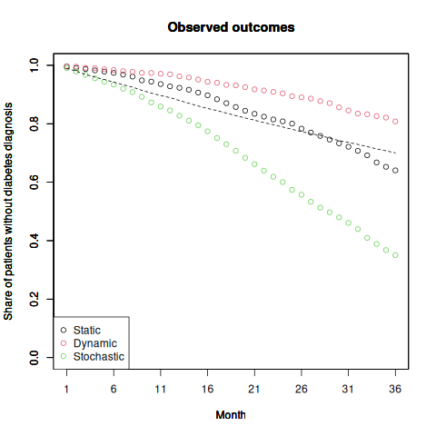
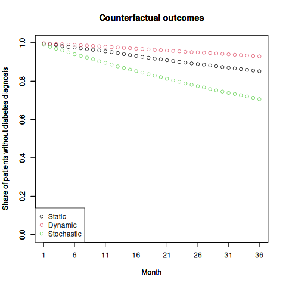

# multi-ltmle

Simulation code for Longitudinal TMLE (LTMLE) with multi-valued treatments. 

Please cite the following papers if you use this repo:

```
@article{doi:10.1002/sim.10003,
  title={Targeted learning in observational studies with multi-valued treatments: An evaluation of antipsychotic drug treatment safety.},
  author={Poulos, Jason and Horvitz-Lennon, Marcela and Zelevinsky, Katya and Cristea-Platon, Tudor and Huijskens, Thomas and Tyagi, Pooja and Yan, Jiaju and Diaz, Jordi and Normand, Sharon-Lise},
  journal={Statistics in Medicine},
  year={2024},
   publisher={Wiley Online Library}
}
```

```
@article{doi:10.1017/S0033291723001502,
  title={Antipsychotics and the risk of diabetes and death among adults with serious mental illnesses},
  author={Poulos, Jason and Normand, Sharon-Lise T and Zelevinsky, Katya and Newcomer, John W and Agniel, Denis and Abing, Haley K and Horvitz-Lennon, Marcela},
  journal={Psychological Medicine},
  volume={53},
  number={16},
  pages={7677--7684},
  year={2023},
  publisher={Cambridge University Press}
}
```

Prerequsites
------

* **R** (tested on 4.0.1 using a 6.2.0 GCC compile)
+ Required **R** packages located in ***package_list.R***
+ The result of sessionInfo() is in ***session_info.txt***

* For use of 'tmle-lstm' as an estimator: **R** (tested on 4.3.1), **python3** (tested on 3.6.8), and **TensorFlow** (tested on 2.12.0) using a GCC 9.2.0 compiler and CUDA 11.7 for GPU computation
+ instructions for installing Tensorflow on Linux (documentation [here](https://packaging.python.org/en/latest/guides/installing-using-pip-and-virtual-environments/) and [here](https://www.tensorflow.org/install/pip#linux))
```
# create virtual environment within directory
cd multi-ltmle
python3 -m venv env
source env/bin/activate

# install Tensorflow and TensorRT
pip install --upgrade pip
# pip install tensorflow-gpu # for GPU build
pip install tensorflow-cpu # for CPU-only build
pip install tensorrt

python3 -c "import tensorflow as tf; print(tf.reduce_sum(tf.random.normal([1000, 1000])))" # verify the CPU setup
# python3 -c "import tensorflow as tf; print(tf.config.list_physical_devices('GPU'))" # verify the GPU setup
```
+ The following Python packages are required: numpy (tested on 1.19.5), pandas (1.1.5), and wandb (0.15.12)
```
pip install numpy
pip install pandas
pip install wandb
```
+ Additional **R** packages are required by setting the *keras* flag in ***package_list.R*** to TRUE. Make sure to install these packages in the virtual environment where python3 and Tensorflow are installed.

+ Ensure that the path in *use_python()* in **simulation.R** corresponds to the virtual environment python path, which you can find using
```
which python
```

Contents
------

* ***package_list.R*** install required **R** packages.
	+ *doMPI*: logical flag. When TRUE, install packages needed for MPI parallel processing. Defaults to FALSE.
	+ *keras*: logical flag. When TRUE, install packages needed for Keras/TensorFlow. Defaults to TRUE.

* ***src/misc_fns***: includes misc. functions, including a function to bound predicted probabilities; functions generate different distributions; and a forest plot function. 

* ***src/simcausal_fns***: defines distribution functions for *simcausal* software.

* ***src/simcausal_dgp***: defines data generating process for *simcausal* software.

* ***src/tmle_fns***: define treatment rule functions for our implementation. 

* ***src/tmle_calculation_long.R***: function for generating counterfactual means under each treatment rule in longitudinal data. Inputs initial Y estimates, bounded cumulative treatment/censoring probabilities, observed treatment, and observed outcomes. Outputs treatment-rule specific means.

* ***src/tmleContrastLong.R***: function for calculating contrasts across all treatment rules in longitudinal data. Inputs treatment-rule-specific means, the contrast matrix, and logical flags. Outputs ATE and variance estimates. 

* ***src/lstm.R***: function for calling Python code for estimating with LSTMs within R; used when estimator ='tmle-lstm'. 

* ***src/train_lstm.py***: Python code for training LSTMs and predicting on the same data; used when estimator ='tmle-lstm'.

* ***src/test_lstm.py***: Python code for inference using a trained LSTMs model on new data; used when estimator ='tmle-lstm'.

* ***simulation.R***: longitudinal setting simulation, comparing the performance of manual multinomial TMLE with existing implementations using multiple binary treatments, with multiple levels of treatment. Simulates data over multiple runs and compares implementations in terms of bias, coverage, and CI width. The script consists of the following relevant parameters:

	+ *estimator*: Select which estimator to use: 'tmle' for our TMLE implementation (multinomial and multiple binary),  using a standard super learner ensemble (also returns estimates from an inverse probability of treatment weighting, IPTW, estimator and g-computation estimator); 'tmle-lstm' for multinomial and multiple binary TMLE using an ensemble of LSTMs (also returns IPTW and g-computation estimates).

	+ *treatment.rule*: Treatment rule; can be "static", "dynamic", "stochastic", or "all" (if *estimator*='tmle')

	+ *gbound* and *ybound* numerical vectors defining bounds to be used for the propensity score and initial Y predictions, resp. Default is c(0.05,1)  and c(0.0001,0.9999), resp.

	+ *J*: number of treatments; must be J=6.

	+ *n*: sample size. Defaults to 12500.

	+ *t.end*: number of time periods, must be at least 4 and no more than 36. Defaults to 36 (must be 36 if estimator='tmle').  

	+ *R*: number of simulation runs. Default is 325. 

	+ *target.gwt*: logical flag. When TRUE, moves propensity weights from denominator of clever covariate to regression weight when fitting updated model for Y; used only for 'tmle' estimator. Default is TRUE. 

	+ *use.SL*: logical flag. When TRUE, use Super Learner for treatment and outcome model estimation; if FALSE, use GLM (**use.SL=FALSE not functional**). 

	+ *scale.continuous*: logical flag. When TRUE, use scale continuous variables before training. Default is FALSE. 

	+ *n.folds*: number of cross-validation folds for Super Learner. Defaults to 5 (must be at at least 3). 

* ***long_sim_plots.R*** combine output from ***simulation.R*** and plot.

Required File Modifications
------

Below is a list of files and specific line numbers that require user modifications to match their environment or particular settings. Please ensure to make these changes before running the code.

### 1. simulation.R
- **Line 32**: Update the Python path used by `use_python()`. Modify it to point to the Python interpreter you wish to use. For example:
  ```r
  use_python("/n/app/python/3.10.11.conda/bin/python")
  ```

### 2. utils.py
- **Line 353**: Configure the GPU settings by modifying `configure_gpu()` or updating relevant CUDA paths if different CUDA versions are used. The default setting is:
  ```python
  cuda_path = "/n/app/cuda/11.7-gcc-9.2.0"
  ```

- **Lines 356-365**: Set TensorFlow-specific environment variables related to CUDA. Ensure these align with your installation.

### 3. train_lstm.py
- **Line 4**: Update the CUDA path used for training RNN models. Modify this path to match your environment. The line looks like:
  ```python
  cuda_path = "/n/app/cuda/11.7-gcc-9.2.0"
  ```
- **Lines 13-14**: Set TensorFlow-specific environment variables related to CUDA. Ensure these align with your installation.

  Modify or add further configurations to suppress unnecessary warnings if required.

Instructions
------

1. Install require **R** packages: `Rscript package_list.R` and follow Python installation instructions in the Prerequsites section. Make sure to start **R** in virtual environment where python3 and Tensorflow are installed.

2. For simulations, run: `Rscript simulation.R [arg1] [arg2] [arg3] [arg4]`; where `[arg1]` specifies the estimator ["tmle", "tmle-lstm"], `[arg2]` is a number specifying the treatment rule [1 for all treatment rules should be used], and `[arg3]`  is a logical flag if super learner estimation is to be used ["TRUE" or "FALSE"], and `[arg4]` is a logical flag for using MPI parallel programming; e.g., 

	`Rscript simulation.R 'tmle' 1 'TRUE' 'FALSE'`

	or 

`Rscript simulation.R 'tmle-lstm' 1 'FALSE' 'FALSE'`

3. To plot simulation results, run: `Rscript long_sim_plots.R [arg1]`; where `[arg1]` specifies the output path of the simulation results. E.g., 
	
	`Rscript long_sim_plots.R 'outputs/20240215'`


Intermediate results
------

The following intermediate results are from a single simulated longitudinal dataset (r=1) for n=12500 patients. We estimate the counterfactual diabetes risk for those who continued to follow each of 3 regimes (static, dynamic, stochastic) in each of 36 time periods, based on the observed outcomes and covariates. They are saved in `ex_outputs/`.

* Simulated dataset in long format `tmle_dat_long_R_1_n_12500_J_6.rds`

* Initial model for A estimator [initial_model_for_A_estimator_tmle_treatment_rule_all_n_folds_5_scale_continuous_FALSE_use_SL_TRUE.rds](https://www.dropbox.com/scl/fi/kw5epwh30z4vh5twilxw5/initial_model_for_A_estimator_tmle_treatment_rule_all_n_folds_5_scale_continuous_FALSE_use_SL_TRUE.rds?rlkey=lxyku41sg1kugtn6n24us3s18&dl=0)

* Longitudinal simulation results [longitudinal_simulation_results_estimator_tmle_treatment_rule_all_R_325_n_12500_J_6_n_folds_5_scale_continuous_FALSE_use_SL_TRUE.rds](https://www.dropbox.com/scl/fi/yzzocspqfxg7qmvipe1wb/longitudinal_simulation_results_estimator_tmle_treatment_rule_all_R_325_n_12500_J_6_n_folds_5_scale_continuous_FALSE_use_SL_TRUE.rds?rlkey=42vg98ka5pvldwmsj0acxuudc&dl=0)

* RNN-based model predictions (multiple binary and categorical treatment)
	+ `lstm_bin_preds.npy`
	+ `lstm_bin_preds_info.npz`
	+ `lstm_cat_preds.npy`
	+ `lstm_cat_preds_info.npz`

* RNN-based model weights (multiple binary and categorical treatment)
	+ `trained_bin_model.h5`
	+ `trained_cat_model.h5`

* Descriptive plots 






